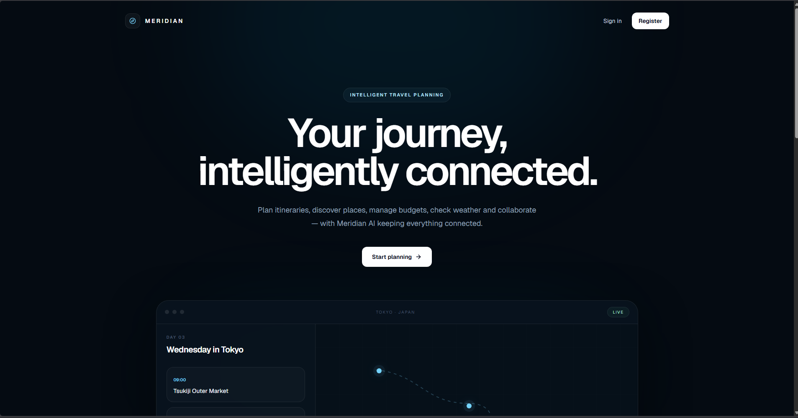
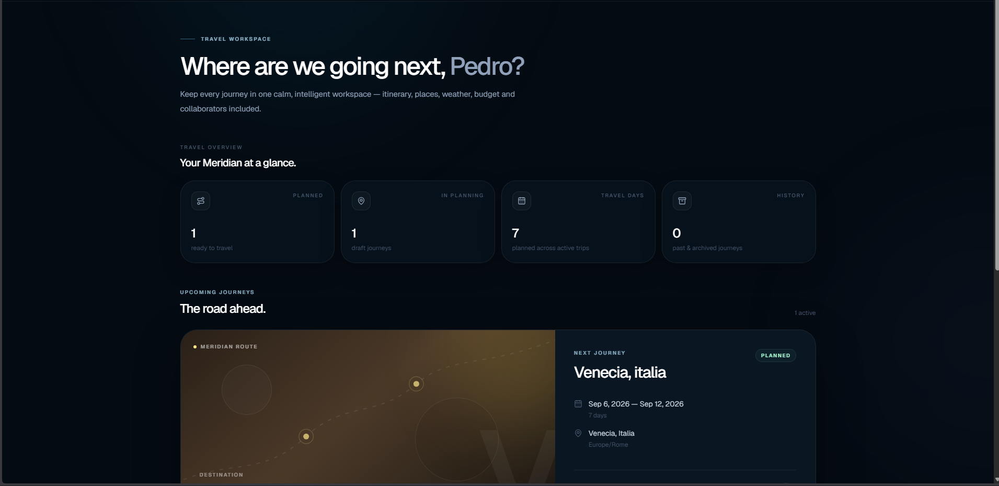
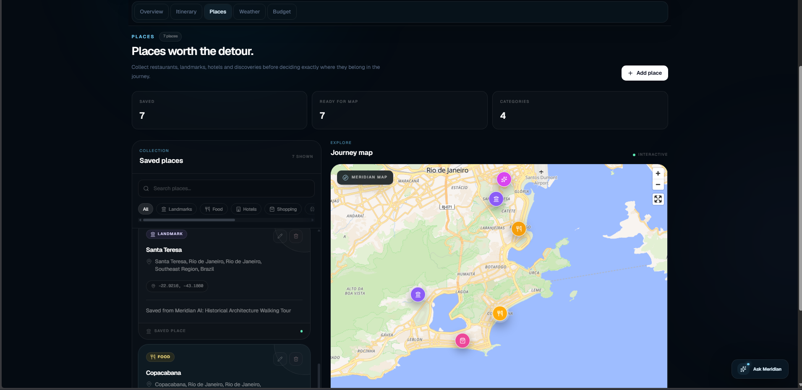
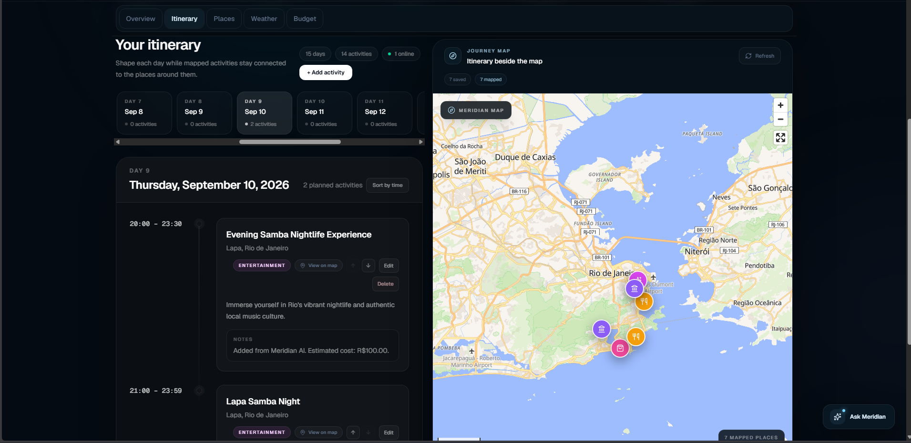
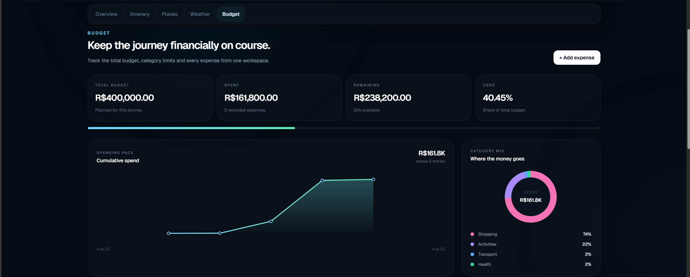
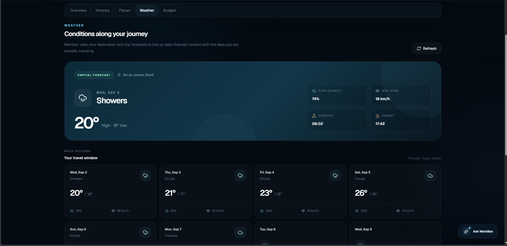
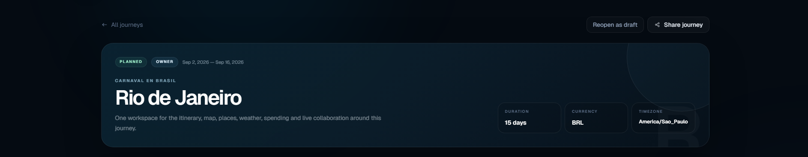
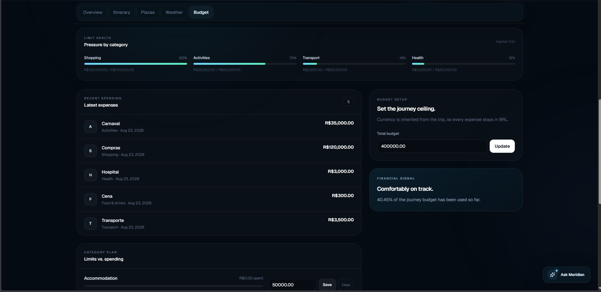
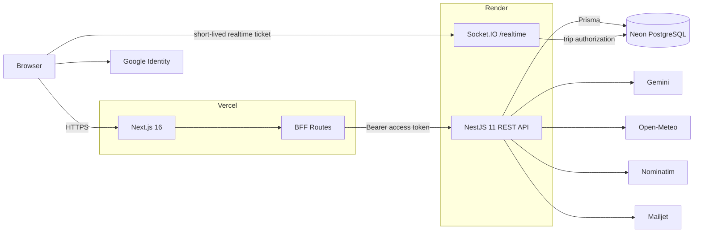

<div align="center">

# Meridian

### Intelligent travel planning, built around the journey.

A production-deployed travel workspace for planning itineraries, discovering places, tracking budgets, checking weather, collaborating in realtime, and using AI-assisted recommendations without losing the structure of the trip.

[**Live Demo**](https://meridian-pi-vert.vercel.app) ·
[**Architecture**](./docs/architecture.md) ·
[**Deployment**](./docs/deployment.md) ·
[**Security**](./docs/security.md) ·
[**Realtime**](./docs/realtime.md)

<br />



</div>

---

## Overview

Meridian is a full-stack travel-planning platform designed as a single workspace around the journey.

Instead of splitting planning across disconnected tools, Meridian brings together the itinerary, saved places, interactive maps, weather context, spending, collaboration and AI-assisted planning in one product.

The project was built as a portfolio-grade production system rather than a static UI exercise: it includes authentication, role-based collaboration, MFA, realtime synchronization, relational persistence, automated testing, CI/CD, Docker validation and a public free-tier deployment.

## Product experience



The dashboard keeps active and planned journeys visible at a glance, while each trip opens into a dedicated workspace with five connected areas:

- **Overview** — destination, dates, timezone, currency and journey context.
- **Itinerary** — day-by-day activities connected to mapped places.
- **Places** — saved landmarks, food, lodging and discoveries on an interactive map.
- **Weather** — forecast context aligned with the travel window.
- **Budget** — total budget, category limits, spending pace and expense history.

## Core capabilities

| Area | What Meridian provides |
|---|---|
| Journey planning | Create, update, archive and delete trips with travel dates, timezone and currency |
| Itinerary | Day-based planning, activities, ordering and place linkage |
| Places & maps | Saved places, geocoding, MapLibre visualization and category filtering |
| Meridian AI | Context-aware recommendations and itinerary assistance |
| Weather | Open-Meteo forecast aligned with destination and trip dates |
| Budget | Budget totals, category limits, expenses and spending analytics |
| Collaboration | OWNER / EDITOR / VIEWER permissions and invitation flows |
| Realtime | Socket.IO trip rooms with itinerary and budget invalidation events |
| Identity | Password auth, Google sign-in/linking, refresh sessions and profile management |
| MFA | TOTP enrollment, recovery codes and challenge verification |
| Password recovery | Expiring reset tokens with transactional email delivery |

## Product tour

<table>
  <tr>
    <td width="50%">
      
    </td>
    <td width="50%">
      
    </td>
  </tr>
  <tr>
    <td><strong>Places + interactive map</strong><br />Saved discoveries stay spatially connected to the journey.</td>
    <td><strong>Itinerary + mapped activities</strong><br />Activities generated or added to the itinerary remain linked to real places.</td>
  </tr>
</table>

<table>
  <tr>
    <td width="50%">
      
    </td>
    <td width="50%">
      
    </td>
  </tr>
  <tr>
    <td><strong>Budget intelligence</strong><br />Track total budget, spending, remaining funds and category mix.</td>
    <td><strong>Travel-window weather</strong><br />Forecast context is aligned with the destination and actual trip dates.</td>
  </tr>
</table>

<details>
  <summary><strong>More product screenshots</strong></summary>
  <br />
  
  <br /><br />
  
</details>

## Architecture



The browser uses the Next.js application and BFF for authenticated REST workflows. NestJS remains the authoritative business layer, PostgreSQL is the source of truth, and Socket.IO is used as a trip-scoped invalidation/presence channel rather than a second persistence layer.

For the complete design, see [`docs/architecture.md`](./docs/architecture.md).

## Engineering highlights

### Authentication and security

- short-lived access tokens with rotating refresh sessions;
- HttpOnly cookie-backed BFF flow;
- Google Identity Services integration;
- TOTP multi-factor authentication;
- hashed recovery and reset tokens;
- Argon2 password hashing;
- Helmet, credentialed CORS allowlist and HSTS in production;
- global DTO validation and throttling;
- fail-fast environment validation;
- owner-only destructive trip deletion.

### Realtime collaboration

Meridian uses Socket.IO rooms scoped by trip.

```text
authenticated REST mutation
        ↓
PostgreSQL commit
        ↓
small trip-scoped realtime event
        ↓
other clients refetch canonical state
```

Current invalidation domains include itinerary changes and budget/expense changes.

Realtime connections use a separate **60-second signed ticket** and still require a fresh trip-access check before joining a room.

### Data integrity

Prisma models the journey as relational data rather than disconnected frontend state.

Trip deletion cascades through journey-owned resources such as:

```text
Trip
├─ TripDay
│  └─ Activity
├─ Place
├─ Budget
│  └─ BudgetCategoryLimit
├─ Expense
└─ TripMember
```

A deleted place does not destroy a linked itinerary activity; the activity link is set to `null`.

## Technology

| Layer | Technology |
|---|---|
| Frontend | Next.js 16, React 19, TypeScript, Tailwind CSS 4, Motion |
| Backend | NestJS 11, TypeScript |
| Database | PostgreSQL, Prisma 7 |
| Maps | MapLibre GL, OpenStreetMap / Nominatim |
| Realtime | Socket.IO |
| AI | Gemini |
| Weather | Open-Meteo |
| Authentication | JWT, Google Identity, Argon2, TOTP MFA |
| Email | Mailjet HTTPS in production, SMTP/Mailpit locally |
| Infrastructure | Vercel, Render, Neon |
| CI/CD | GitHub Actions |
| Tooling | pnpm workspaces, Turbo, Docker |
| Testing | Jest, Supertest, PostgreSQL E2E |

## Testing and delivery

The current regression baseline includes:

- **161 unit tests** across **24 suites**;
- **82 E2E tests** across **12 suites**;
- API formatting, typecheck, lint and production build;
- web typecheck, lint and production build;
- real PostgreSQL in E2E;
- production dependency audit;
- Docker image builds for both application targets.

The GitHub Actions pipeline validates:

```text
API · quality + unit + build
API · E2E + PostgreSQL
Web · typecheck + lint + build
Security · production dependency audit
Docker · api image
Docker · web image
```

See [`docs/ci-cd.md`](./docs/ci-cd.md).

## Production

| Service | Platform |
|---|---|
| Web + BFF | Vercel |
| API + Socket.IO | Render |
| PostgreSQL | Neon |
| Transactional email | Mailjet |
| AI provider | Gemini |
| Weather provider | Open-Meteo |
| Geocoding | Nominatim / OpenStreetMap |

**Live application:** [meridian-pi-vert.vercel.app](https://meridian-pi-vert.vercel.app)

The deployment intentionally uses free tiers. Render cold starts can make the first API request after inactivity slower than a warm request.

See [`docs/deployment.md`](./docs/deployment.md).

## Repository structure

```text
meridian/
├─ apps/
│  ├─ api/                 # NestJS API, Prisma, realtime and E2E
│  └─ web/                 # Next.js application and BFF
├─ packages/               # Shared workspace packages
├─ docs/
│  ├─ assets/              # Product screenshots used by this README
│  ├─ architecture.md
│  ├─ ci-cd.md
│  ├─ decisions.md
│  ├─ deployment.md
│  ├─ realtime.md
│  └─ security.md
├─ .github/workflows/      # CI/CD
├─ pnpm-workspace.yaml
└─ package.json
```

## Local development

### Requirements

- Node.js 22
- pnpm 11
- PostgreSQL
- environment variables based on `apps/api/.env.example`

Install workspace dependencies:

```bash
pnpm install
```

Generate the Prisma client and apply the local database migrations using the configured development database, then start the workspace:

```bash
pnpm dev
```

The default local application topology uses the web on port `3000` and the API on port `3001`.

Do not commit real `.env` files or production credentials.

## Documentation

Detailed technical documentation lives in [`docs/`](./docs/README.md):

- [System architecture](./docs/architecture.md)
- [Deployment and environments](./docs/deployment.md)
- [Security and trust boundaries](./docs/security.md)
- [Realtime collaboration](./docs/realtime.md)
- [CI/CD](./docs/ci-cd.md)
- [Architecture decisions](./docs/decisions.md)

## Project status

**Completed · production deployed · portfolio release**

Meridian was built to demonstrate product design and full-stack engineering in the same project: from interface and domain modeling through authentication, realtime collaboration, AI integration, automated testing, security hardening and cloud deployment.
