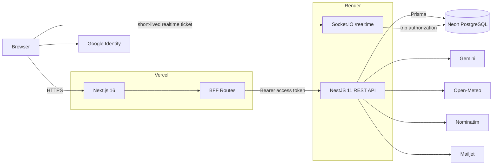

<div align="center">

# Meridian

### Intelligent travel planning, built around the journey.

A production-deployed travel workspace for planning itineraries, discovering places, tracking budgets, checking weather, collaborating in realtime, and using AI-assisted recommendations without losing the structure of the trip.

[**Live Demo**](https://meridian-pi-vert.vercel.app) ·
[**Architecture**](./docs/architecture.md) ·
[**Deployment**](./docs/deployment.md) ·
[**Security**](./docs/security.md) ·
[**Performance V2**](#meridian-v2-performance-engineering) ·
[**Realtime**](./docs/realtime.md)

<br />


</div>

---

## Overview

Meridian is a full-stack travel-planning platform designed as a single workspace around the journey.

Instead of splitting planning across disconnected tools, Meridian brings together the itinerary, saved places, interactive maps, weather context, spending, collaboration and AI-assisted planning in one product.

The project was built as a portfolio-grade production system rather than a static UI exercise: it includes authentication, role-based collaboration, MFA, realtime synchronization, relational persistence, automated testing, CI/CD, Docker validation and a public free-tier deployment.

## Product experience


The dashboard keeps active and planned journeys visible at a glance, while each trip opens into a dedicated workspace with five connected areas:

- **Overview** — destination, dates, timezone, currency and journey context.
- **Itinerary** — day-by-day activities connected to mapped places.
- **Places** — saved landmarks, food, lodging and discoveries on an interactive map.
- **Weather** — forecast context aligned with the travel window.
- **Budget** — total budget, category limits, spending pace and expense history.

## Core capabilities

| Area | What Meridian provides |
|---|---|
| Journey planning | Create, update, archive and delete trips with travel dates, timezone and currency |
| Itinerary | Day-based planning, activities, ordering and place linkage |
| Places & maps | Saved places, geocoding, MapLibre visualization and category filtering |
| Meridian AI | Context-aware recommendations and itinerary assistance |
| Weather | Open-Meteo forecast aligned with destination and trip dates |
| Budget | Budget totals, category limits, expenses and spending analytics |
| Collaboration | OWNER / EDITOR / VIEWER permissions and invitation flows |
| Realtime | Socket.IO trip rooms with itinerary and budget invalidation events |
| Identity | Password auth, Google sign-in/linking, refresh sessions and profile management |
| MFA | TOTP enrollment, recovery codes and challenge verification |
| Password recovery | Expiring reset tokens with transactional email delivery |

## Product tour

<table>
  <tr>
    <td width="50%">
      
    </td>
    <td width="50%">
      
    </td>
  </tr>
  <tr>
    <td><strong>Places + interactive map</strong><br />Saved discoveries stay spatially connected to the journey.</td>
    <td><strong>Itinerary + mapped activities</strong><br />Activities generated or added to the itinerary remain linked to real places.</td>
  </tr>
</table>

<table>
  <tr>
    <td width="50%">
      
    </td>
    <td width="50%">
      
    </td>
  </tr>
  <tr>
    <td><strong>Budget intelligence</strong><br />Track total budget, spending, remaining funds and category mix.</td>
    <td><strong>Travel-window weather</strong><br />Forecast context is aligned with the destination and actual trip dates.</td>
  </tr>
</table>

<details>
  <summary><strong>More product screenshots</strong></summary>
  <br />
  
  <br /><br />
  
</details>

## Architecture



The browser uses the Next.js application and BFF for authenticated REST workflows. NestJS remains the authoritative business layer, PostgreSQL is the source of truth, and Socket.IO is used as a trip-scoped invalidation/presence channel rather than a second persistence layer.

For the complete design, see [`docs/architecture.md`](./docs/architecture.md).

## Engineering highlights

### Authentication and security

- short-lived access tokens with rotating refresh sessions;
- HttpOnly cookie-backed BFF flow;
- Google Identity Services integration;
- TOTP multi-factor authentication;
- hashed recovery and reset tokens;
- Argon2 password hashing;
- Helmet, credentialed CORS allowlist and HSTS in production;
- global DTO validation and throttling;
- fail-fast environment validation;
- owner-only destructive trip deletion.

### Realtime collaboration

Meridian uses Socket.IO rooms scoped by trip.

```text
authenticated REST mutation
        ↓
PostgreSQL commit
        ↓
small trip-scoped realtime event
        ↓
other clients refetch canonical state
```

Current invalidation domains include itinerary changes and budget/expense changes.

Realtime connections use a separate **60-second signed ticket** and still require a fresh trip-access check before joining a room.

### Data integrity

Prisma models the journey as relational data rather than disconnected frontend state.

Trip deletion cascades through journey-owned resources such as:

```text
Trip
├─ TripDay
│  └─ Activity
├─ Place
├─ Budget
│  └─ BudgetCategoryLimit
├─ Expense
└─ TripMember
```

A deleted place does not destroy a linked itinerary activity; the activity link is set to `null`.

## Technology

| Layer | Technology |
|---|---|
| Frontend | Next.js 16, React 19, TypeScript, Tailwind CSS 4, Motion |
| Backend | NestJS 11, TypeScript |
| Database | PostgreSQL, Prisma 7 |
| Maps | MapLibre GL, OpenStreetMap / Nominatim |
| Realtime | Socket.IO |
| Cache | Redis |
| Background jobs | BullMQ, Redis |
| Observability | Jaeger tracing, application metrics |
| Performance testing | k6, Docker stats |
| AI | Gemini |
| Weather | Open-Meteo |
| Authentication | JWT, Google Identity, Argon2, TOTP MFA |
| Email | Mailjet HTTPS in production, SMTP/Mailpit locally |
| Infrastructure | Vercel, Render, Neon |
| CI/CD | GitHub Actions |
| Tooling | pnpm workspaces, Turbo, Docker |
| Testing | Jest, Supertest, PostgreSQL E2E |

## Meridian V2 performance engineering

Meridian V2 extends the product architecture with a dedicated performance-engineering layer focused on observability, caching, asynchronous workloads, repeatable benchmarking, targeted optimization and measured capacity.

The work was executed as seven performance sprints, starting from a reproducible V1 baseline and ending with controlled capacity and stress testing.

### V2 performance roadmap

| Sprint | Focus | Result |
|---|---|---|
| S0 | V1 performance baseline | Reproducible k6 baseline and deterministic benchmark dataset |
| S1 | Observability | Request-level tracing and performance evidence through Jaeger |
| S2 | Redis caching | Redis-backed caching introduced for repeated read workloads |
| S3 | BullMQ | Background-work infrastructure separated through BullMQ and Redis |
| S4 | V2 validation | V2 behavior and performance validated against the established benchmark |
| S5 | Targeted optimization | Redundant budget aggregation query removed without changing behavior |
| S6 | Capacity / stress testing | Sustainable region, operating edge and tail-latency degradation measured |

All seven Meridian V2 performance sprints are complete.

### Reference performance topology

The production architecture documented elsewhere in this repository remains the authoritative deployment model.

Performance validation was executed against a controlled local Docker reference environment containing the services required to measure and isolate backend behavior.

~~~mermaid
flowchart LR
    K6[k6 load generator]

    API[NestJS API]
    DB[(PostgreSQL)]

    CACHE[(Redis cache)]
    QUEUE[(Queue Redis)]
    WORKER[BullMQ worker]

    TRACE[Jaeger]

    K6 -->|HTTP workload| API

    API -->|Prisma| DB
    API -->|cached reads and invalidation| CACHE
    API -->|background jobs| QUEUE
    QUEUE --> WORKER

    API -. request traces .-> TRACE
~~~

The benchmark reference environment used:

- 12 Docker CPUs;
- approximately 7.65 GiB of Docker memory;
- no explicit CPU or memory limits on the API, PostgreSQL or Redis containers;
- a deterministic benchmark dataset;
- k6 constant-arrival-rate scenarios;
- Docker resource sampling during selected capacity runs.

These measurements describe the Meridian local development and validation environment. They must not be interpreted as production-capacity guarantees.

### S0 — V1 baseline

Before introducing V2 performance changes, Meridian established a reproducible V1 benchmark.

The historical runner remains preserved at:

[`performance/k6/v1-baseline.js`](./performance/k6/v1-baseline.js)

The baseline methodology and evidence provide a stable reference for subsequent performance work rather than rewriting historical measurements after the architecture changed.

### S1 — observability

The first V2 infrastructure step introduced the visibility required to optimize safely.

Jaeger-backed tracing was used during performance validation to correlate HTTP requests with backend and database work instead of treating endpoint latency as an isolated metric.

This instrumentation was used throughout subsequent sprints to distinguish structural improvements from normal benchmark variance.

### S2 — Redis caching

V2 introduced Redis-backed caching for repeated read workflows.

The cache layer reduces repeated backend work while PostgreSQL remains the authoritative source of data.

Caching was implemented with explicit invalidation behavior so cached state does not become an independent source of truth.

Redis is intentionally isolated from the queue Redis instance used by BullMQ in the local reference topology.

### S3 — BullMQ background processing

Background-work infrastructure was introduced with BullMQ and Redis.

A dedicated worker process consumes queued jobs separately from the main NestJS API process.

This establishes a foundation for moving suitable expensive or delayed operations outside the synchronous request lifecycle while keeping API behavior deterministic.

The local Docker topology therefore includes:

- the NestJS API;
- a dedicated BullMQ worker;
- Redis for application caching;
- a separate Redis instance for queue infrastructure.

### S4 — V2 performance validation

After observability, caching and asynchronous job infrastructure were introduced, V2 was validated as a complete system against the controlled benchmark dataset.

Validation covered:

- request correctness;
- endpoint latency;
- error rate;
- dropped iterations;
- database behavior;
- reliability across repeated runs;
- comparison against the established baseline;
- tracing evidence for backend behavior.

The purpose of S4 was not merely to obtain a faster number. It verified that the V2 infrastructure preserved application behavior while providing a measurable foundation for targeted optimization.

### S5 — targeted optimization

Performance evidence identified redundant work in the budget overview request path.

The budget service previously performed a separate expense aggregate query even though the required totals could be derived from the existing grouped expense query result.

The optimization removed that redundant database operation and derived the totals using the existing bigint-cent values.

Measured structural impact:

| Metric | Before | After | Change |
|---|---:|---:|---:|
| Budget SQL SELECTs | 6 | 5 | -16.7% |
| Prisma DB-query operations | 6 | 5 | -16.7% |
| Typical traced spans | 31 | 27 | ~-12.9% |

Functional behavior remained unchanged.

Repeated latency measurements remained within normal run-to-run variability, so the optimization is intentionally documented as a structural backend improvement rather than claiming an unsupported latency improvement.

Detailed evidence:

[`docs/metrics/v2-targeted-optimization.md`](./docs/metrics/v2-targeted-optimization.md)

### S6 — capacity and stress testing

The final V2 sprint introduced a dedicated configurable capacity runner:

[`performance/k6/v2-capacity.js`](./performance/k6/v2-capacity.js)

The historical V1 benchmark runner was intentionally left unchanged.

The V2 capacity runner uses a constant-arrival-rate workload with configurable:

- offered request rate;
- duration;
- pre-allocated virtual users;
- maximum virtual users;
- benchmark run identifier.

Stress testing intentionally does not apply a latency/error threshold that would abort the experiment before degradation can be observed.

S6 separated two fundamentally different limits:

1. application security-policy limits;
2. technical backend capacity and latency behavior.

#### Security-policy ceiling

The normal API throttling configuration uses:

- 300 requests per 60-second window;
- a 15-second block duration;
- `/health` excluded from throttling.

At 64 offered RPS under the normal configuration, the benchmark observed:

- approximately 63.91 completed requests/second;
- 21.56% non-2xx responses;
- approximately 78.44% successful checks;
- zero dropped iterations.

Infrastructure utilization and latency did not indicate backend saturation.

A controlled run at the same 64 RPS with the throttle temporarily raised produced:

- 63.86 requests/second;
- 0% errors;
- 100% successful checks;
- zero dropped iterations;
- p95: 9.52 ms;
- p99: 12.60 ms.

This demonstrated that the failure observed at 64 RPS under the normal configuration was caused by the application throttling policy rather than technical backend saturation.

The original production throttle configuration was restored immediately after the controlled experiment and the API was rebuilt and verified healthy.

#### Technical capacity behavior

With the security-policy limit temporarily moved out of the path for controlled technical testing, the measured capacity curve was:

| Offered load | Throughput | Errors | p95 | p99 | API CPU peak | Interpretation |
|---:|---:|---:|---:|---:|---:|---|
| 64 RPS | 63.86 RPS | 0% | 9.52 ms | 12.60 ms | n/a | healthy control |
| 128 RPS | 127.82 RPS | 0% | 8.91 ms | 14.71 ms | 65.36% | healthy |
| 192 RPS | 191.68 RPS | 0% | 10.64 ms | 18.44 ms | 95.00% | clearly sustainable |
| 224 RPS | 223.66 RPS | 0% | 14.55 ms | 41.59 ms | 98.59% | upper operating edge |
| 232 RPS | 231.65 RPS | 0% | 98.40 ms | 176.05 ms | 126.52% | significant tail-latency pressure |
| 240 RPS | 239.64 RPS | 0% | 25.62 ms | 144.76 ms | 119.29% | degraded / unstable tail |
| 256 RPS | 255.59 RPS | 0% | 213.49 ms | 504.98 ms | 125.06% | severe degradation |

The 232 and 240 RPS runs demonstrate normal benchmark variability, so Meridian does not claim one exact saturation number from an individual run.

The combined evidence supports the following interpretation:

- **192 RPS** is the clearly sustainable measured region;
- **224 RPS** is the measured upper operating edge;
- tail-latency instability emerges above 224 RPS;
- the **232–240 RPS region** shows significant queueing pressure;
- **256 RPS** demonstrates severe tail-latency degradation;
- no hard throughput ceiling was reached because completed throughput remained close to the requested rate even at 256 RPS.

The experiment was intentionally stopped once severe latency degradation had been established rather than increasing load solely to force request errors or dropped iterations.

At the 232 RPS pressure point, sampled resource peaks were:

- API: 126.52% CPU;
- PostgreSQL: 20.99% CPU;
- Redis: 0.36% CPU.

The evidence therefore points toward API-side contention or queueing as the primary pressure layer.

It does not, by itself, prove one specific Node.js or event-loop bottleneck.

Full capacity analysis:

[`docs/metrics/v2-capacity-report.md`](./docs/metrics/v2-capacity-report.md)

Machine-readable capacity summary:

[`performance/results/v2-capacity-summary.json`](./performance/results/v2-capacity-summary.json)

### Performance evidence

Meridian preserves benchmark artifacts in the repository so documented performance claims can be traced to measured evidence.

Important V2 evidence includes:

- targeted optimization reports;
- k6 capacity results;
- Docker resource samples;
- machine-readable summaries;
- the final capacity and stress report.

Capacity artifacts are stored under:

`performance/results/`

Performance documentation is stored under:

`docs/metrics/`

### Running the V2 capacity benchmark

The benchmark user password must be supplied at runtime and must never be committed to the repository.

Example PowerShell run at 128 RPS:

~~~powershell
k6 run `
  -e BENCHMARK_PASSWORD="$env:BENCHMARK_PASSWORD" `
  -e MANIFEST_PATH="../data/benchmark-manifest-v2.json" `
  -e BASE_URL="http://localhost:3001/api/v1" `
  -e RATE="128" `
  -e DURATION="60s" `
  -e PRE_ALLOCATED_VUS="256" `
  -e MAX_VUS="1024" `
  -e RUN_ID="local-v2-capacity" `
  .\performance\k6\v2-capacity.js
~~~

The runner can be reused for smoke, capacity and controlled stress scenarios by changing the offered rate, duration and VU allocation.

### Performance conclusions

Meridian V2 demonstrates a complete performance-engineering workflow rather than a single benchmark result:

- establish a reproducible baseline;
- instrument the backend before optimizing;
- introduce caching with explicit invalidation;
- separate asynchronous workloads;
- validate behavior after infrastructure changes;
- remove measured redundant backend work;
- distinguish security-policy limits from technical saturation;
- measure a sustainable operating region;
- identify tail-latency degradation before throughput collapse;
- preserve benchmark artifacts as repository evidence.

The resulting system maintains low latency through its clearly sustainable measured region while exposing a measurable tail-latency knee before request throughput collapses.

## Testing and delivery

The current regression baseline includes:

- **161 unit tests** across **24 suites**;
- **82 E2E tests** across **12 suites**;
- API formatting, typecheck, lint and production build;
- web typecheck, lint and production build;
- real PostgreSQL in E2E;
- production dependency audit;
- Docker image builds for both application targets.

The GitHub Actions pipeline validates:

```text
API · quality + unit + build
API · E2E + PostgreSQL
Web · typecheck + lint + build
Security · production dependency audit
Docker · api image
Docker · web image
```

See [`docs/ci-cd.md`](./docs/ci-cd.md).

## Production

| Service | Platform |
|---|---|
| Web + BFF | Vercel |
| API + Socket.IO | Render |
| PostgreSQL | Neon |
| Transactional email | Mailjet |
| AI provider | Gemini |
| Weather provider | Open-Meteo |
| Geocoding | Nominatim / OpenStreetMap |

**Live application:** [meridian-pi-vert.vercel.app](https://meridian-pi-vert.vercel.app)

The deployment intentionally uses free tiers. Render cold starts can make the first API request after inactivity slower than a warm request.

See [`docs/deployment.md`](./docs/deployment.md).

## Repository structure

```text
meridian/
├─ apps/
│  ├─ api/                 # NestJS API, Prisma, realtime and E2E
│  └─ web/                 # Next.js application and BFF
├─ packages/               # Shared workspace packages
├─ docs/
│  ├─ assets/              # Product screenshots used by this README
│  ├─ architecture.md
│  ├─ ci-cd.md
│  ├─ decisions.md
│  ├─ deployment.md
│  ├─ realtime.md
│  └─ security.md
├─ .github/workflows/      # CI/CD
├─ pnpm-workspace.yaml
└─ package.json
```

### Performance engineering paths

Performance-specific assets are organized separately from application code:

~~~text
docs/metrics/                          # Benchmark methodology and engineering reports
performance/k6/                        # Reproducible k6 workload definitions
performance/results/                   # Machine-readable benchmark and resource evidence
~~~

The repository intentionally preserves benchmark evidence so performance claims documented in the project can be traced back to the corresponding measured runs.

Key performance assets include:

- historical and V2 k6 workload definitions;
- benchmark result JSON files;
- Docker resource-sampling CSV files;
- machine-readable performance summaries;
- human-readable engineering reports.

## Local development

### Requirements

- Node.js 22
- pnpm 11
- PostgreSQL
- environment variables based on `apps/api/.env.example`

Install workspace dependencies:

```bash
pnpm install
```

Generate the Prisma client and apply the local database migrations using the configured development database, then start the workspace:

```bash
pnpm dev
```

The default local application topology uses the web on port `3000` and the API on port `3001`.

Do not commit real `.env` files or production credentials.

## Documentation

Detailed technical documentation lives in [`docs/`](./docs/README.md):

- [System architecture](./docs/architecture.md)
- [Deployment and environments](./docs/deployment.md)
- [Security and trust boundaries](./docs/security.md)
- [Realtime collaboration](./docs/realtime.md)
- [CI/CD](./docs/ci-cd.md)
- [Architecture decisions](./docs/decisions.md)

### Performance and benchmark documentation

The complete Meridian V2 performance-engineering evidence is documented in the following reports:

- [V1 k6 baseline methodology](./docs/metrics/v1-k6-baseline.md)
- [V1 baseline report](./docs/metrics/v1-baseline-report.md)
- [V2 observability report](./docs/metrics/v2-observability-report.md)
- [V2 Redis validation](./docs/metrics/v2-redis-report.md)
- [V2 performance validation](./docs/metrics/v2-performance-report.md)
- [V2 targeted optimization](./docs/metrics/v2-targeted-optimization.md)
- [V2 capacity and stress testing](./docs/metrics/v2-capacity-report.md)
- [V2 capacity machine-readable summary](./performance/results/v2-capacity-summary.json)

Raw benchmark outputs and resource samples are preserved under:

- [`performance/results/`](./performance/results/)
- [`performance/k6/`](./performance/k6/)

## Project status

**Completed · production deployed · portfolio release**

Meridian was built to demonstrate product design and full-stack engineering in the same project: from interface and domain modeling through authentication, realtime collaboration, AI integration, automated testing, security hardening and cloud deployment.

### Meridian V2 performance program

The completed Meridian V2 performance program extends the project beyond functional full-stack delivery into measured performance engineering.

The V2 work demonstrates:

- reproducible baseline construction with k6;
- Jaeger-backed observability and request tracing;
- Redis caching with explicit invalidation;
- BullMQ-backed asynchronous job infrastructure;
- repeatable V1-to-V2 performance validation;
- query-level backend optimization based on measured evidence;
- controlled capacity and stress testing;
- separation of security-policy limits from technical backend behavior;
- identification of a sustainable operating region and tail-latency degradation;
- preservation of raw benchmark evidence and machine-readable summaries.

The complete performance roadmap from S0 through S6 is finished and documented in this repository.
