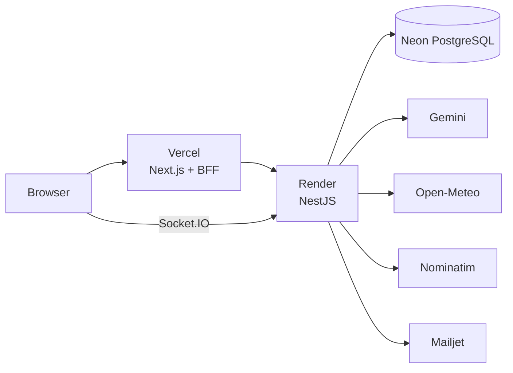

# Meridian — Technical Documentation

This directory contains Meridian's architecture and operational documentation.

| Document | Purpose |
|---|---|
| [architecture.md](./architecture.md) | System topology, boundaries, request flow, data model and integrations |
| [deployment.md](./deployment.md) | Vercel/Render/Neon deployment model, environments and release flow |
| [security.md](./security.md) | HTTP hardening, auth boundaries, realtime security, secrets and DB integrity |
| [realtime.md](./realtime.md) | Socket.IO authentication, trip rooms, presence and invalidation events |
| [ci-cd.md](./ci-cd.md) | GitHub Actions quality gates, E2E, audit and Docker validation |
| [decisions.md](./decisions.md) | ADR-style record of major architecture decisions |

## Current production architecture

## Documentation scope

These documents describe the architecture after Meridian's free-tier production deployment and production smoke hardening.

The repository root portfolio-facing `README.md` is intentionally separate from this technical documentation and belongs to the final showcase/polishing phase.
