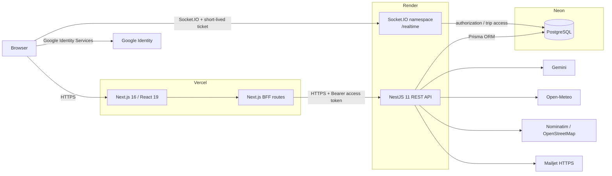
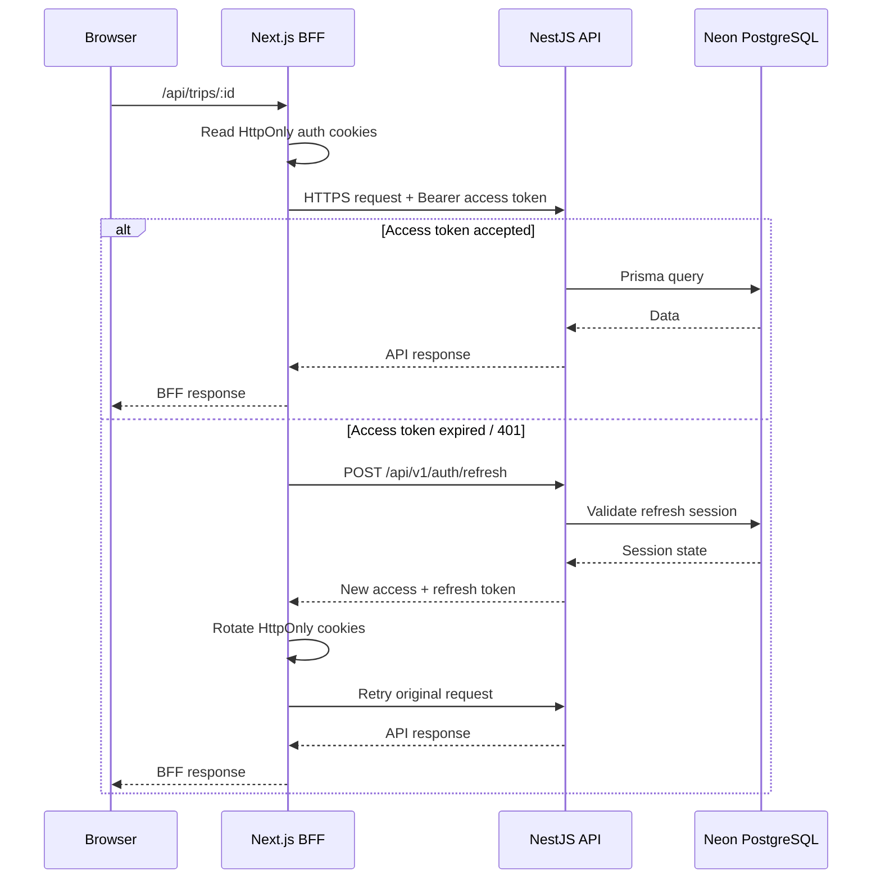

# Meridian — Architecture

## Purpose

Meridian is an intelligent travel-planning platform organized as a pnpm monorepo. The production system separates the public web application, API, realtime channel, relational database, and third-party providers so each concern can evolve independently while keeping the product deployable on a zero-budget/free-tier architecture.

## System context



## Runtime responsibilities

### Web — Next.js on Vercel

The web application owns the browser experience and the server-side BFF layer.

Responsibilities:

- render the public landing page, authentication flows, dashboard and trip workspace;
- expose BFF routes under `/api/...`;
- keep API access behind server-side calls where appropriate;
- read the Meridian access and refresh tokens from HttpOnly cookies;
- attach the access token as `Authorization: Bearer ...` when calling the Nest API;
- recover an expired access token by calling the refresh endpoint and retrying the original request;
- clear authentication cookies if refresh or the retried request is rejected;
- connect the browser to the realtime namespace using a short-lived realtime ticket.

`apps/web/next.config.ts` uses standalone output outside Vercel, but lets Vercel use its native output mode. It also defines a `/api/v1/:path*` rewrite to `API_ORIGIN`.

### API — NestJS on Render

The API is the authoritative application layer.

The root module composes:

- Security
- Database
- Health
- Users
- Authentication
- Trips
- Realtime
- Itinerary
- Places
- Geocoding
- Budget
- Expenses
- Weather
- Meridian AI

The application is globally prefixed with `/api/v1`.

Cross-cutting API behavior includes:

- Helmet security headers;
- explicit credentialed CORS origins;
- production HSTS;
- global request validation;
- global throttling;
- environment validation at startup;
- graceful shutdown hooks.

### Database — PostgreSQL on Neon

Prisma 7 is the ORM and migration layer.

The production connection strategy intentionally separates runtime and migration concerns:

```text
Runtime
DATABASE_URL
  └─ Neon pooled connection

Prisma CLI / migrations
DIRECT_URL
  └─ Neon direct connection
```

`prisma.config.ts` prefers `DIRECT_URL` for Prisma CLI operations and falls back to `DATABASE_URL`, preserving local development behavior.

The data model includes:

- users and authentication sessions;
- federated identities;
- TOTP credentials and MFA recovery codes;
- MFA challenges;
- password-reset tokens;
- trips and trip memberships;
- trip days and activities;
- saved places;
- budgets and category limits;
- expenses.

Trip-owned resources use cascading deletes where appropriate. An activity linked to a deleted place uses `SetNull`, avoiding accidental activity deletion when only a place reference is removed.

## Request flow

### Authenticated REST request



## Realtime flow

Realtime collaboration is intentionally separate from the long-lived browser authentication cookies.

1. An authenticated client requests a realtime ticket.
2. The API signs a ticket with a 60-second lifetime and `type: "realtime"`.
3. The browser opens Socket.IO namespace `/realtime` and sends the ticket in the handshake auth payload.
4. The gateway verifies the ticket.
5. The client asks to join a trip.
6. The gateway checks current trip access before joining `trip:<tripId>`.
7. Presence and mutation events are scoped to the trip room.

This design prevents a normal access token from being directly reused as the long-lived socket credential.

## Data ownership and authorization

Trip access is modeled with a single owner plus optional memberships.

```text
OWNER
  └─ full trip control

EDITOR
  └─ collaborative editing capabilities

VIEWER
  └─ read-only collaboration
```

The owner remains distinct from `TripMember`; members are represented by `TripMemberRole` values `EDITOR` and `VIEWER`.

## External integrations

| Integration | Role | Direction |
|---|---|---|
| Google Identity Services | Google sign-in / identity | Browser + API validation |
| Gemini | Meridian AI recommendations/planning | API → Gemini |
| Open-Meteo | Weather forecast | API → Open-Meteo |
| Nominatim / OpenStreetMap | Geocoding | API → Nominatim |
| Mailjet | Production transactional email | API → Mailjet HTTPS |

Local mail development uses SMTP-compatible configuration; production is configured to use Mailjet's HTTPS API.

## Production topology

```text
Internet
   │
   ▼
Vercel
Next.js 16 + BFF
   │
   ├──────────── Browser realtime ────────────┐
   │                                          │
   ▼                                          ▼
Render                                     Socket.IO
NestJS REST API                        /realtime namespace
   │                                          │
   └──────────────────┬───────────────────────┘
                      ▼
                Neon PostgreSQL

External providers:
Google Identity · Gemini · Open-Meteo · Nominatim · Mailjet
```

## Architectural boundaries

The core trust boundaries are:

1. **Browser → Vercel**: untrusted client input enters the application.
2. **Vercel → Render**: server-side BFF calls the authoritative API.
3. **Browser → Socket.IO**: socket access requires a separate, short-lived signed ticket.
4. **Render → Neon**: application data access through Prisma/PostgreSQL.
5. **Render → third parties**: provider credentials stay server-side.
6. **GitHub → deployment platforms**: `main` is the production source branch after CI and review.

## Design goals

The architecture optimizes for:

- strong portfolio-grade separation of concerns;
- explicit security boundaries;
- independently deployable web and API services;
- realtime collaboration without coupling socket authentication to browser cookies;
- relational consistency through PostgreSQL and Prisma;
- zero-budget deployment using free tiers;
- a CI pipeline that tests the same major runtime boundaries before production.
