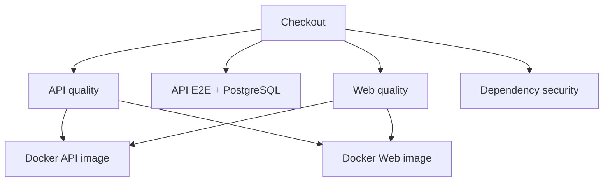
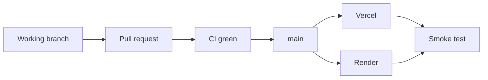

# Meridian — CI/CD

## Overview

Meridian uses GitHub Actions as the release quality gate.

Workflow:

```text
.github/workflows/ci.yml
```

Triggers:

```text
push
pull_request
```

Concurrency cancels superseded runs for the same workflow/reference.

Global toolchain:

```text
Node.js 22
pnpm 11.20.0
```

## Pipeline



There are five job definitions, while the Docker matrix produces two image checks, so the workflow surfaces six major check results.

## API quality

Job:

```text
API · quality + unit + build
```

Steps:

1. checkout;
2. configure pnpm;
3. configure Node;
4. frozen-lockfile install;
5. generate Prisma client;
6. formatting check;
7. TypeScript check;
8. ESLint;
9. unit tests;
10. Nest production build.

Commands include:

```text
pnpm --filter @meridian/api format:check
pnpm --filter @meridian/api typecheck
pnpm --filter @meridian/api lint:check
pnpm --filter @meridian/api test
pnpm --filter @meridian/api build
```

## API E2E

Job:

```text
API · E2E + PostgreSQL
```

The workflow provisions PostgreSQL 18 as a GitHub Actions service:

```text
database: meridian_test
host port: 5433
```

The job:

1. creates an isolated E2E environment;
2. generates Prisma client;
3. applies migrations with `prisma migrate deploy`;
4. runs all E2E suites in-band.

Command:

```text
pnpm --filter @meridian/api test:e2e
```

This verifies behavior against a real relational database rather than mocking the persistence boundary.

## Web quality

Job:

```text
Web · typecheck + lint + build
```

It supplies safe CI placeholders for required web configuration and executes:

```text
pnpm --filter @meridian/web typecheck
pnpm --filter @meridian/web lint
pnpm --filter @meridian/web build
```

The build is part of CI because framework-level route generation and server/client boundaries can fail even when plain TypeScript compilation succeeds.

## Dependency security

Job:

```text
Security · production dependency audit
```

Command:

```text
pnpm audit --prod --audit-level high
```

The workspace contains an explicit exception for:

```text
GHSA-ggr8-5vv4-36mx
```

This is a narrow, documented exception and must not become a general bypass for new high/critical advisories.

## Docker verification

Job:

```text
Docker · api image
Docker · web image
```

The matrix builds both targets from the repository root Dockerfile and does not push them.

It uses GitHub Actions cache and then inspects:

- repository tags;
- image size;
- configured runtime user.

The Docker jobs depend on both API and web quality jobs.

## Release policy

Production deploys from:

```text
main
```

Recommended release flow:



A merge should not be considered a completed release until both hosting platforms have deployed and the targeted production smoke test passes.

## Local pre-push gates

For API-impacting changes:

```powershell
pnpm --filter @meridian/api format
pnpm --filter @meridian/api format:check
pnpm --filter @meridian/api typecheck
pnpm --filter @meridian/api lint:check
pnpm --filter @meridian/api test
pnpm --filter @meridian/api test:e2e
pnpm --filter @meridian/api build
```

For web-impacting changes:

```powershell
pnpm --filter @meridian/web typecheck
pnpm --filter @meridian/web lint
pnpm --filter @meridian/web build
```

Repository hygiene:

```powershell
git diff --check
git status
```

## CI principles

Meridian's pipeline follows these rules:

- lockfile must be reproducible;
- generated Prisma client must compile from the checked-in schema;
- unit and E2E responsibilities remain separate;
- E2E uses PostgreSQL;
- production web build is mandatory;
- production dependency audit is mandatory;
- Docker buildability is continuously verified;
- CI runs on both pushes and pull requests.
