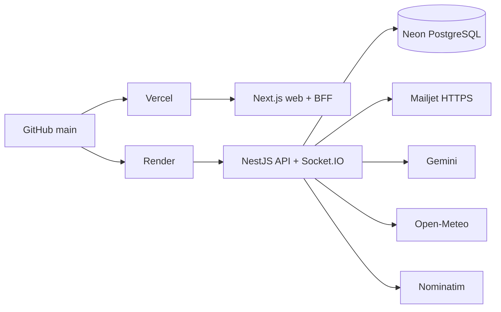
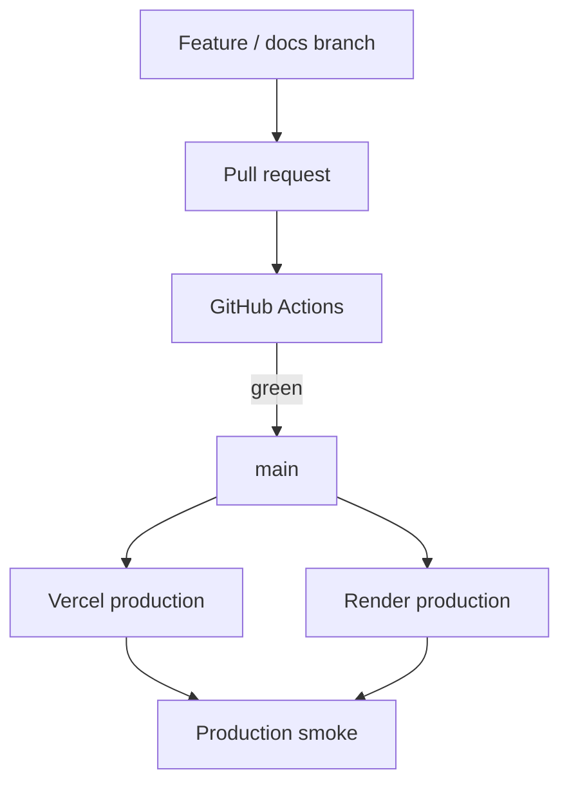

# Meridian — Deployment and Environments

## Production deployment

Meridian currently deploys from the `main` branch.



Production endpoints:

- Web: `https://meridian-pi-vert.vercel.app`
- API: `https://meridian-api-703x.onrender.com`
- API health: `https://meridian-api-703x.onrender.com/api/v1/health`

## Environment model

| Concern | Local development | Test / CI | Production |
|---|---|---|---|
| Web | Next.js dev server | Next production build | Vercel |
| API | Nest watch/dev | Nest + Jest/E2E | Render |
| Database | PostgreSQL development DB | isolated PostgreSQL `meridian_test` | Neon PostgreSQL |
| Mail | SMTP / Mailpit-compatible | test doubles / test configuration | Mailjet HTTPS |
| Realtime | Socket.IO `/realtime` | gateway tests / E2E coverage | Render Socket.IO |
| Secrets | local env files | CI environment | platform environment variables |

The submitted F16 source did not include the local Compose file, so this document deliberately avoids prescribing its exact service definitions.

## Render API

The production API uses `apps/api/Dockerfile.render`.

### Build stage

- Node.js 22 Bookworm slim.
- pnpm 11.20.0.
- OpenSSL and CA certificates installed for Prisma/TLS requirements.
- dependencies installed with the workspace lockfile;
- Prisma client generated;
- NestJS production build generated.

### Runtime stage

- Node.js 22 Bookworm slim;
- `NODE_ENV=production`;
- default `PORT=10000`;
- only built application/runtime dependencies copied;
- container runs as the non-root `node` user;
- starts with:

```text
node apps/api/dist/main.js
```

## Vercel web

The web app uses Next.js 16.

`apps/web/next.config.ts` makes deployment behavior environment-aware:

```text
VERCEL present
  → use Vercel-native output

VERCEL absent
  → output: standalone
```

The configuration also sets the monorepo output tracing root and forwards `/api/v1/:path*` to `API_ORIGIN`.

## Database deployment

Prisma configuration uses:

```text
DIRECT_URL ?? DATABASE_URL
```

This supports:

- a pooled Neon URL for application runtime;
- a direct Neon URL for migration/CLI operations;
- the same Prisma schema for local and production environments.

Recommended migration sequence:

```text
1. Validate production environment variables
2. prisma migrate deploy using DIRECT_URL
3. Deploy API
4. Verify /api/v1/health
5. Deploy/verify web
6. Run production smoke test
```

Schema changes must be shipped as migrations; production should not use interactive development migration commands.

## Mail delivery

The API supports two mail providers:

```text
MAIL_PROVIDER=smtp
  → local SMTP workflow

MAIL_PROVIDER=mailjet
  → production HTTPS delivery
```

When `MAIL_PROVIDER=mailjet`, startup validation requires:

- `MAILJET_API_KEY`
- `MAILJET_SECRET_KEY`
- `MAIL_FROM_EMAIL`

and requires the Mailjet endpoint to use HTTPS.

## Required production configuration

The exact secrets must never be committed. The checked-in `.env.example` documents the configuration contract.

Important API variables include:

```text
NODE_ENV
PORT
CORS_ORIGIN
APP_ORIGIN
TRUST_PROXY

DATABASE_URL
DIRECT_URL

JWT_ACCESS_SECRET
JWT_REFRESH_SECRET
JWT_ACCESS_TTL_SECONDS
JWT_REFRESH_TTL_SECONDS

MFA_ENCRYPTION_KEY

GOOGLE_CLIENT_ID
GEMINI_API_KEY
GEMINI_MODEL

GEOCODING_BASE_URL
GEOCODING_USER_AGENT

PASSWORD_RESET_TTL_MINUTES

MAIL_PROVIDER
MAILJET_API_URL
MAILJET_API_KEY
MAILJET_SECRET_KEY
MAIL_FROM_EMAIL
MAIL_FROM_NAME
```

Important web deployment variables include the API origin, cookie configuration, Google client ID, and realtime origin used by the deployed web application.

## Release flow



The intended production rule is:

> A change is not considered released until `main` is green, both deployment platforms are healthy, and a targeted smoke test passes.

## Production smoke checklist

For application releases, verify at minimum:

- API health and database connectivity;
- authentication;
- dashboard and trip loading;
- itinerary mutation;
- weather resolution;
- budget and expense realtime refresh;
- owner-only destructive trip deletion;
- role restrictions for editor/viewer;
- AI request path;
- password-reset delivery;
- no fatal browser CORS/runtime errors.

## Free-tier operational trade-offs

The deployment deliberately prioritizes zero recurring infrastructure cost.

### Render

- Free compute can cold-start after inactivity.
- Initial API calls may therefore be slower than warm requests.
- Meridian does not assume a production SLA from this tier.

### Neon

- Separating pooled runtime connections from direct migration connections reduces unnecessary connection pressure.
- The application should continue treating PostgreSQL as the source of truth rather than relying on in-memory state.

### Vercel

- Well suited to the Next.js web/BFF layer.
- Production remains driven by Git integration with `main`.

### External providers

Provider outages or unresolved data must degrade into explicit unavailable/error states instead of breaking the entire trip workspace.

## Rollback strategy

Because production is Git-driven, the simplest rollback is:

1. identify the last known-good commit on `main`;
2. revert the faulty change through Git;
3. merge the revert;
4. let Vercel and Render redeploy;
5. verify API health and the affected product path.

Database migrations need separate care: destructive migrations should be designed with backward compatibility and data recovery in mind rather than relying on application-code rollback alone.
