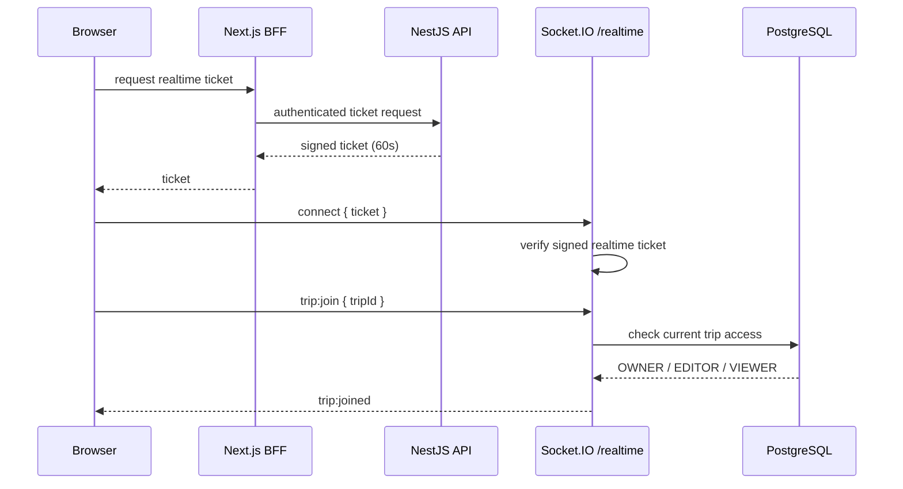
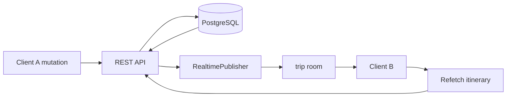

# Meridian — Realtime Collaboration

## Purpose

Meridian uses Socket.IO to synchronize collaborative trip state without replacing REST as the source of truth.

The core rule is:

> REST performs authoritative mutations; realtime events tell other clients that canonical state changed.

This avoids maintaining a second business-data model inside Socket.IO.

## Namespace and authentication

The backend exposes:

```text
/realtime
```

A normal socket connection is not accepted without a realtime ticket.



## Ticket properties

The realtime ticket contains identity information and:

```text
type = "realtime"
TTL  = 60 seconds
```

The gateway rejects the connection when the ticket is missing, invalid, expired, or does not contain the expected realtime type.

## Trip rooms

After authentication, a client must explicitly join a trip.

Room convention:

```text
trip:<tripId>
```

The gateway verifies current trip access before allowing the join.

Failed access produces a generic:

```text
Trip access denied
```

rather than exposing resource ownership details.

## Presence

Presence state is tracked as:

```text
tripId
  └─ userId
      └─ socketId(s)
```

This lets Meridian distinguish:

- unique online users;
- multiple tabs/windows from the same user.

The room receives:

```text
trip:presence
```

with the number of unique online users.

Disconnecting a single tab removes only that socket. A user disappears from presence only when their last socket leaves.

## Mutation synchronization

Meridian currently publishes canonical invalidation events including:

```text
itinerary:changed
budget:changed
```

The event payload identifies the trip and change context, but clients refetch authoritative REST state rather than trusting a full business object sent through the socket.

### Itinerary



### Budget and expenses

Budget and expense mutations use the same invalidation pattern.

```text
Budget / expense mutation
        ↓
REST succeeds
        ↓
PostgreSQL is canonical
        ↓
budget:changed
        ↓
trip room
        ↓
other BudgetPanel
        ↓
refetch budget overview + expenses
```

This was chosen instead of pushing entire budget payloads through Socket.IO.

## Why REST remains authoritative

Advantages:

- validation logic stays in one code path;
- authorization stays in one code path;
- retries are simpler;
- reconnecting clients can fully recover by refetching;
- socket event payloads remain small;
- stale clients do not need to replay a complete event history;
- the database remains the source of truth.

## Reconnection behavior

The frontend obtains a ticket and mounts a trip-specific realtime subscription in the active collaborative feature.

On connection/reconnection, clients can rejoin the trip room and refresh relevant canonical state.

This is particularly important on free-tier hosting where an API process may cold-start or transiently disconnect.

## Security properties

Realtime security depends on all of the following:

1. short-lived signed ticket;
2. ticket type validation;
3. authenticated socket state;
4. current trip access check;
5. room-scoped events;
6. REST authorization on every mutation.

A socket connection by itself does not grant write access.

## Events

| Event | Direction | Purpose |
|---|---|---|
| `trip:join` | client → server | request membership in a trip room |
| `trip:leave` | client → server | leave trip room |
| `trip:joined` | server → client | confirms room join and access role |
| `trip:error` | server → client | generic realtime access/error state |
| `trip:presence` | server → room | unique online-user count |
| `itinerary:changed` | server → room | invalidate/refetch itinerary state |
| `budget:changed` | server → room | invalidate/refetch budget + expenses |

## Failure model

If realtime is unavailable:

- REST mutations should still be authoritative;
- the mutating client receives its normal REST result;
- another client may temporarily remain stale;
- reconnect/refetch restores consistency.

Realtime improves collaboration freshness; it is not the persistence layer.

## Future extension rule

New collaborative domains should follow the same pattern:

```text
successful REST mutation
  → publish small trip-scoped event
  → receiver refetches canonical resource
```

Avoid introducing full-object socket state unless there is a measured product requirement that REST invalidation cannot satisfy.
