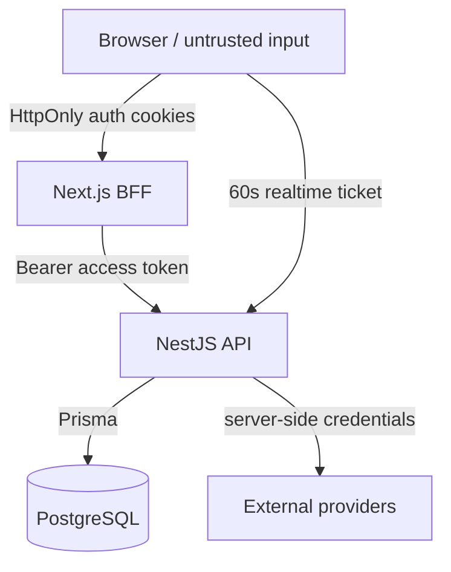

# Meridian — Security and Trust Boundaries

## Security model

Meridian applies security at multiple layers rather than relying on a single authentication check.



## Startup environment validation

The API validates critical configuration before serving traffic.

Validation includes:

- `NODE_ENV` restricted to development, test, or production;
- valid PostgreSQL `DATABASE_URL`;
- separate access and refresh JWT secrets;
- minimum 32-character JWT secrets outside tests;
- a valid base64-encoded 32-byte MFA encryption key;
- explicit CORS origins;
- rejection of `*` CORS when credentials are enabled;
- `APP_ORIGIN` required in production;
- restricted trust-proxy values;
- bounded port and token TTL values;
- valid mail-provider configuration;
- HTTPS-only Mailjet API URL.

This makes deployment misconfiguration a startup failure instead of a latent runtime vulnerability.

## HTTP hardening

`configureApplication()` applies:

### Helmet

Security headers are enabled globally.

In production, HSTS is enabled with:

- max age: 15,552,000 seconds;
- subdomains included.

CSP, COEP and CORP are disabled in the current application configuration to preserve compatibility with the product's external integrations and browser behavior. This should be treated as an explicit trade-off, not an assumption that those controls are unnecessary.

### CORS

CORS uses an explicit allowlist derived from `CORS_ORIGIN`.

Configuration:

- credentials enabled;
- allowed methods: GET, HEAD, POST, PUT, PATCH, DELETE, OPTIONS;
- allowed headers: Authorization, Content-Type;
- exposed header: Retry-After;
- preflight max age: 600 seconds.

Wildcard origins are rejected by environment validation.

### Request validation

A global `ValidationPipe` uses:

```text
whitelist: true
forbidNonWhitelisted: true
transform: true
```

Unexpected DTO fields are therefore rejected rather than silently accepted.

## Rate limiting

The global security module configures a default throttler:

```text
300 requests / 1 minute
15 second block duration
```

The custom `MeridianThrottlerGuard` is registered as an application guard.

Rate limiting is skipped under `NODE_ENV=test` so automated suites remain deterministic.

## Authentication boundary

The web BFF reads the Meridian access and refresh tokens from server-managed cookies.

For authenticated API requests it:

1. reads the current token pair;
2. attaches the access token as a Bearer token;
3. if the API returns 401, attempts refresh;
4. stores the rotated token pair;
5. retries the original request;
6. clears cookies if authentication remains invalid.

This keeps browser application code from manually constructing the main API Authorization header for BFF-backed requests.

## Persisted authentication security state

The Prisma schema stores security-sensitive state in non-plaintext forms where applicable:

- `AuthSession.refreshTokenHash`
- encrypted TOTP material as ciphertext + IV + authentication tag fields;
- `MfaRecoveryCode.codeHash`
- `MfaChallenge.tokenHash`
- `PasswordResetToken.tokenHash`

The schema also provides expiration, revocation, consumption and used-at fields required for session and one-time-token lifecycle enforcement.

## Realtime authentication

Realtime uses a separate short-lived credential.

`RealtimeTicketService`:

- signs a JWT with the normal access-secret material;
- sets `type: "realtime"`;
- expires the ticket after 60 seconds;
- validates type and required identity claims on connection.

The Socket.IO gateway rejects:

- missing tickets;
- invalid tickets;
- expired tickets.

After authentication, joining a trip still requires a fresh authorization check through `TripsService`.

This gives two gates:

```text
Valid realtime identity
        +
Current trip access
        =
Join trip room
```

## Realtime isolation

Each trip maps to:

```text
trip:<tripId>
```

Presence and mutation events are emitted only to that room.

Presence is tracked by user and socket, so one user with multiple tabs is still counted once in the trip's online-user total.

## Authorization and ownership

Trip authorization is based on:

- a dedicated `ownerId` on `Trip`;
- optional `TripMember` records;
- roles `EDITOR` and `VIEWER`.

The product permission model is:

| Capability | OWNER | EDITOR | VIEWER |
|---|:---:|:---:|:---:|
| View trip | ✅ | ✅ | ✅ |
| View itinerary | ✅ | ✅ | ✅ |
| Create/edit/delete/reorder itinerary | ✅ | ✅ | ❌ |
| Edit places | ✅ | ✅ | ❌ |
| Edit budget / expenses | ✅ | ✅ | ❌ |
| Use mutation-oriented AI planning | ✅ | ✅ | ❌ |
| Manage collaborators | ✅ | ❌ | ❌ |
| Modify trip core settings | ✅ | ❌ | ❌ |
| Delete journey | ✅ | ❌ | ❌ |

Destructive trip deletion is intentionally owner-only in both API authorization and UI exposure.

## Database integrity

Foreign-key delete behavior is explicit.

Examples:

- deleting a trip cascades to trip days, places, budget, expenses and memberships;
- deleting a trip day cascades to activities;
- deleting a budget cascades to category limits;
- deleting a place sets `Activity.placeId` to null rather than deleting the activity.

This limits orphaned data and makes destructive operations predictable.

## Secrets policy

Never commit:

- production `.env` files;
- JWT secrets;
- database passwords/URLs containing credentials;
- MFA encryption keys;
- Google server credentials;
- Gemini API keys;
- Mailjet keys;
- SMTP credentials.

The checked-in `.env.example` is the contract, not a secret store.

## Dependency security

GitHub Actions runs:

```text
pnpm audit --prod --audit-level high
```

The workspace currently contains one explicitly ignored advisory:

```text
GHSA-ggr8-5vv4-36mx
```

That exception exists in `pnpm-workspace.yaml`. It should remain documented and periodically reviewed; new high/critical advisories must not be silently added to the ignore list.

## Container security

The Render runtime container:

- uses a slim Node base;
- installs only required OS TLS/Prisma runtime packages;
- runs the application as the non-root `node` user.

CI also builds and inspects both application image targets.

## Trust-boundary checklist

When adding a feature, ask:

1. Does untrusted browser input cross into a server boundary?
2. Is authorization checked against current database state?
3. Are provider credentials server-side only?
4. Does a socket event require authenticated room membership?
5. Is the new environment variable validated?
6. Can a destructive DB operation cascade unexpectedly?
7. Does the CI suite cover the security/authorization failure path?
